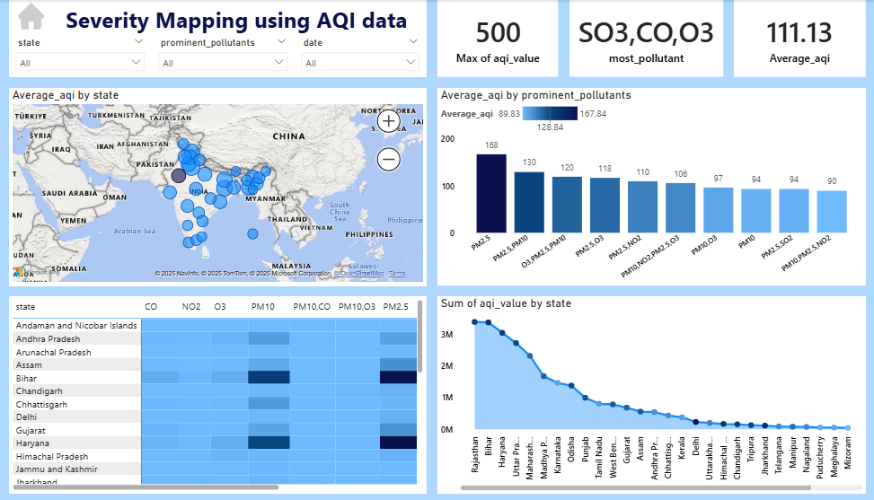
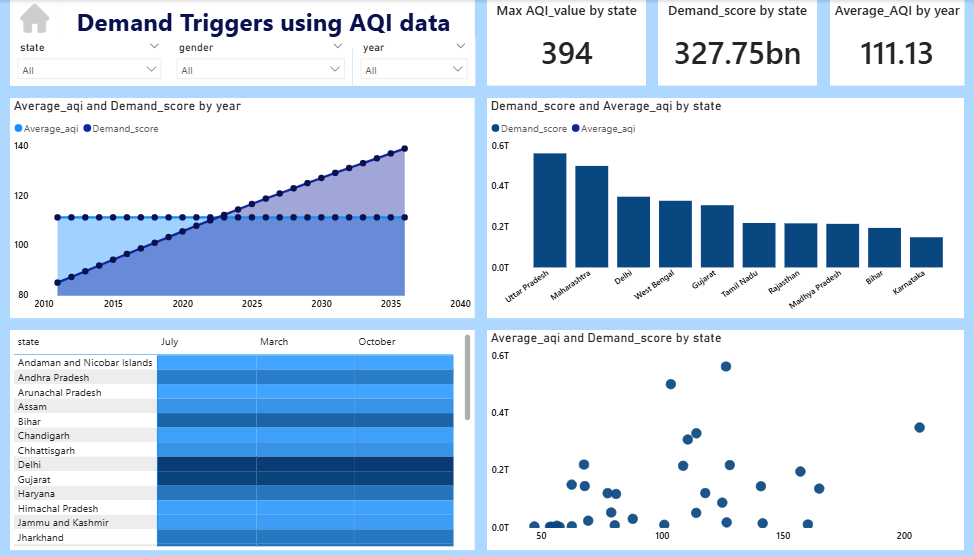

# Air Purifier Analysis
## Project Summary

This project analyses India’s air quality data to assess market readiness for launching an air purifier product. The analysis focuses on three key areas: air pollution severity, health impact, and consumer demand behaviour. Using AQI, pollutant-level data, health statistics, and demand indicators, the project identifies high-risk regions, dominant pollutants, and seasonal demand patterns.

The dashboards highlight that PM2.5 and PM10 are the most critical pollutants, air pollution is persistent across several states, and health impacts increase with long-term exposure. Demand analysis shows a strong relationship between rising AQI levels and air purifier interest, with higher demand in densely populated and highly polluted regions.

The insights support data-driven decisions related to product design, regional launch strategy, marketing timing, and R&D focus. This project demonstrates how environmental and health data can be used to guide practical business and product strategy decisions.

[Click here to view Live Dashboard](https://app.powerbi.com/view?r=eyJrIjoiODk3MTdjZGUtNjRjYS00MTk2LTg2NzAtZjUxMGU4ZGMxM2Q2IiwidCI6IjNmZmZmN2I2LTdlZjQtNGZhNC04ZmVhLTc5OGFiMDQ1NTcxNCJ9)

## Table of Content

1. [About the Company](#about-the-company)
2. [Client Requirement and Objective](#client-requirement-and-objective)
3. [Primary Goals of the Analysis](#primary-goals-of-the-analysis)
4. [Datasets Used](#datasets-used-for-the-project)
5. [Tools and Techniques Used](#tools-and-techniques-used)
6. [Severity Mapping Analysis](#severity-mapping-analysis)
7. [Health Impact Analysis](#health-impact-analysis)
8. [Demand Triggers Analysis](#demand-triggers-analysis)
9. [Recommendations](#recommendations)
10. [Conclusion](#conclusion)

## About the Company: 

Air Pure Innovations is a start-up focused on developing air purifier products for the Indian market. India faces severe air pollution challenges, with several cities consistently ranking among the most polluted in the world. Due to rising health concerns and increasing public awareness, the company wants to understand whether there is strong and long-term demand for air purifiers before investing in product development and large-scale production.

## Client Requirement and Objective:
The leadership team at Air Pure Innovations wants to evaluate the market readiness for an air purifier product. Before committing resources to R&D and manufacturing, the company needs clear answers to the following business questions:
- Which pollutants should the air purifier mainly target?
- Which product features are most important for Indian conditions?
- Which cities and states show the highest demand potential?
- How should product development align with local pollution patterns?
The objective of this analysis is to provide data-driven insights that support product design, launch strategy, and market prioritization.

[Home](#table-of-content)
## Primary Goals of the Analysis:
- Identify regions with severe and persistent air pollution
- Understand the health impact of poor air quality
- Measure how pollution influences consumer demand for air purifiers
- Support strategic decisions for product design and market launch

## Datasets Used for the Project:
This project is based on air quality and health-related datasets across India, including:
-	AQI Data: Daily and yearly AQI values by state
-	Pollutant Data: PM2.5, PM10, CO, NO₂, O₃, and SO₂ levels
-	Health Data: Pollution-related illness cases and deaths
-	Demand Data: Demand score indicating air purifier interest
-	Time Data: Year and seasonal information
These datasets together help connect pollution levels, health impact, and consumer demand.

[Home](#table-of-content)

## Tools and Techniques Used:
### Tools
Microsoft Excel
- Initial data cleaning and validation
- Basic exploration of AQI and health data
Power BI
- Created interactive dashboards
- Built KPIs using DAX
- Applied filters by state, year, and pollutant
### Techniques
- Data Cleaning: Removing missing and inconsistent values
- Data Modelling: Linking AQI, health, and demand datasets
- KPI Creation: Average AQI, maximum AQI, total cases, demand score
- Data Visualization: Maps, bar charts, line charts, and heatmaps

[Home](#table-of-content)

## Severity Mapping Analysis:
The Severity Mapping dashboard focuses on understanding how severe air pollution is across different regions and which pollutants contribute the most.

### Key Insights  
-	Average AQI levels in many states are above safe limits, indicating unhealthy air quality.
-	PM2.5 and PM10 are the most dominant pollutants across India.
-	Some states experience extreme AQI spikes, even if their yearly average is moderate.
-	Northern and western states show consistently high pollution levels.
### Business Interpretation
Air pollution in India is persistent and widespread, not seasonal or temporary. This supports the need for air purifiers designed for continuous daily use, especially in high-risk regions.

[Home](#table-of-content)

## Health Impact Analysis:
The Health Impact dashboard analyses the relationship between air pollution and health outcomes.

### Key Insights
-	States with higher AQI levels also report higher numbers of pollution-related illness cases.
-	Health cases have increased over time, even when AQI levels remained relatively stable.
-	This indicates the effect of long-term exposure to polluted air.
-	Highly populated states show stronger health impact due to greater exposure.
  
### Business Interpretation
Poor air quality directly affects people’s health, increasing awareness and urgency. This creates strong demand for health-focused air purification solutions, especially for families, children, and elderly individuals.

[Home](#table-of-content)

## Demand Triggers Analysis:
The Demand Triggers dashboard examines how pollution levels influence consumer interest in air purifiers.

### Key Insights
- Demand score increases as AQI increases, showing a strong relationship between pollution and demand.
- States such as Uttar Pradesh, Maharashtra, Delhi, and West Bengal show the highest demand potential.
- Demand remains high even when AQI stabilizes, indicating preventive buying behaviour.
- Seasonal trends show higher demand during winter months, when pollution worsens.
  
### Business Interpretation
Air purifier demand is no longer driven only by sudden pollution spikes. Consumers are increasingly purchasing air purifiers as a preventive health measure, indicating long-term market potential.

[Home](#table-of-content)

## Recommendations:
Based on the analysis, the following recommendations are suggested:
### Product Recommendations
-	Prioritize PM2.5 and PM10 filtration as core product functionality
-	Include real-time AQI monitoring and automatic mode adjustment
-	Design products suitable for long-duration indoor usage
### Market & Launch Recommendations
-	Launch initially in high-pollution and high-demand states
-	Focus on urban and densely populated regions
-	Avoid nationwide launch; use a phased, region-based approach
### Marketing Recommendations
-	Position the air purifier as a health protection product, not a luxury item
-	Start marketing campaigns before winter pollution season
-	Emphasize protection for children and elderly family members
### R&D Recommendations
-	Customize product testing based on local pollution patterns
-	Improve filter durability for regions with extreme AQI spikes
-	Continuously monitor AQI trends to guide future product upgrades

[Home](#table-of-content)
 
## Conclusion:
This analysis shows that India has strong, consistent, and growing demand for air purifiers driven by poor air quality and increasing health awareness. Air pollution is a long-term challenge, not a temporary issue.
By using AQI, health, and demand data together, Air Pure Innovations can confidently move forward with product development, targeted market entry, and strategic positioning.

[Home](#table-of-content)

